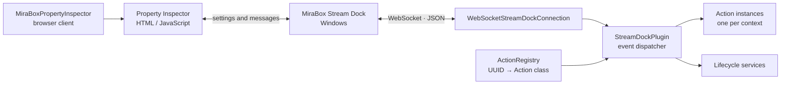

<div align="center">
  <p><strong>English</strong> · <a href="https://github.com/Nekit678/MiraboxStreamDockSDK/blob/main/README.ru.md">Русский</a></p>
  
  <h1>MiraBox Stream Dock SDK</h1>
  <p><strong>A typed Python SDK for building MiraBox Stream Dock plugins</strong></p>
  <p>
    <a href="https://pypi.org/project/mirabox-stream-dock-sdk/"></a>
    <a href="https://www.python.org/downloads/"></a>
    
    <a href="https://github.com/Nekit678/MiraboxStreamDockSDK/actions/workflows/ci.yml"></a>
    <a href="https://github.com/Nekit678/MiraboxStreamDockSDK/blob/main/LICENSE"></a>
  </p>
  <p>
    Build reusable actions for keys, touch panels, and dials<br>
    without hand-writing the Stream Dock WebSocket protocol.
  </p>
  <p>
    <a href="#quick-start">Quick start</a> ·
    <a href="https://pypi.org/project/mirabox-stream-dock-sdk/">PyPI</a> ·
    <a href="#counter-example-plugin">Example plugin</a> ·
    <a href="#protocol-basis">Protocol</a> ·
    <a href="#api-overview">API</a> ·
    <a href="#development">Development</a>
  </p>
</div>

---

## About

`mirabox-stream-dock-sdk` provides the protocol, runtime, and browser-side tools
needed to build Python plugins for MiraBox Stream Dock. It validates launch
arguments and incoming messages, creates one typed action instance per visible
control, dispatches lifecycle events, and serializes commands back to the
Stream Dock application.

The SDK was originally developed as part of a Stream Dock plugin. It was later
extracted into a standalone project so the protocol and runtime could be reused
across plugins, tested independently, and evolved as a public package. The SDK
will continue to be improved as it is used in real plugins and more Stream Dock
behavior is verified.

> [!IMPORTANT]
> The project is currently in the `0.x` series. It is ready for experimentation
> and real plugin development, but public APIs may evolve between minor releases
> before `1.0`.

> [!NOTE]
> This is an unofficial community project and is not affiliated with or endorsed
> by MiraBox, HotSpot, or Elgato. The callback name
> `connectElgatoStreamDeckSocket` is retained because Stream Dock uses it for
> Property Inspector compatibility.

## Table of contents

- [Features](#features)
- [How it works](#how-it-works)
- [Requirements](#requirements)
- [Installation](#installation)
- [Quick start](#quick-start)
- [Property Inspector client](#property-inspector-client)
- [Counter example plugin](#counter-example-plugin)
- [Protocol basis](#protocol-basis)
- [API overview](#api-overview)
- [Errors and unknown events](#errors-and-unknown-events)
- [Inbound event queue](#inbound-event-queue)
- [Outbound command bus](#outbound-command-bus)
- [Concurrency contract](#concurrency-contract)
- [Logging](#logging)
- [Project structure](#project-structure)
- [Development](#development)
- [Releasing](#releasing)

## Features

| | Feature | What it provides |
|:--:|---|---|
| 🧩 | Typed protocol | Dataclass models for registration, commands, and key, touch, dial, device, application, and settings events. |
| 🧭 | Precise validation | Malformed payloads report the event name and exact JSON field path that failed validation. |
| 🎛️ | Action runtime | One action instance per Stream Dock context, declarative UUID registration, and automatic lifecycle dispatch. |
| 🔌 | WebSocket transport | Registration, message parsing, command serialization, logging, and graceful shutdown. |
| 🗃️ | Typed settings | Pluggable codecs for action settings, global settings, and Property Inspector messages. |
| 🖥️ | Property Inspector | A versioned, dependency-free JavaScript client with connection state, events, settings helpers, and queued startup messages. |
| 🧰 | Plugin services | Start and stop plugin-owned background services in a predictable order. |
| 📦 | Distribution tooling | A CLI resource copier, PyInstaller example, package verification, CI, and Trusted Publishing workflow. |
| 🛡️ | Forward compatibility | Unknown but valid events can be preserved as `UnknownStreamDockEvent` instead of breaking the plugin. |

## How it works


```mermaid
flowchart LR
    App["MiraBox Stream Dock<br>Windows"] <-->|"WebSocket · JSON"| Connection["WebSocketStreamDockConnection"]
    Connection --> Runtime["StreamDockPlugin<br>event dispatcher"]
    Registry["ActionRegistry<br>UUID → Action class"] --> Runtime
    Runtime --> Actions["Action instances<br>one per context"]
    Runtime --> Services["Lifecycle services"]
    PI["Property Inspector<br>HTML / JavaScript"] <-->|"settings and messages"| App
    Client["MiraBoxPropertyInspector<br>browser client"] --> PI
```

Stream Dock starts the packaged plugin executable with the WebSocket port,
plugin UUID, registration event, and application metadata. `run_plugin_cli()`
parses those arguments, while `StreamDockPlugin` registers the plugin and maps
incoming events to the appropriate action instance.

## Requirements

- Python `3.11+`;
- MiraBox Stream Dock `2.10.179.426` or newer (declared minimum);
- `websocket-client>=1.8,<2` (installed automatically);
- Windows to run Stream Dock and package a standalone plugin with PyInstaller.

The SDK's Stream Dock integration has been manually verified with Stream Dock
`3.10.203.0701`.

The SDK itself and its test suite can be developed on Windows, Linux, or WSL.
The final `.exe` must be built on Windows because PyInstaller is not a
cross-compiler.

## Installation

Install the released package from PyPI:

```bash
python -m pip install mirabox-stream-dock-sdk
```

To work on the SDK from source:

```bash
git clone https://github.com/Nekit678/MiraboxStreamDockSDK.git
cd MiraboxStreamDockSDK
python -m venv .venv
```

<details>
<summary><strong>Windows PowerShell</strong></summary>

```powershell
.venv\Scripts\Activate.ps1
python -m pip install --upgrade pip
python -m pip install -e ".[dev]"
```

</details>

<details>
<summary><strong>Linux / WSL</strong></summary>

```bash
source .venv/bin/activate
python -m pip install --upgrade pip
python -m pip install -e ".[dev]"
```

</details>

## Quick start

Define dependencies shared by your action instances, register each action UUID,
and return a configured `StreamDockPlugin` from the application factory:

```python
from __future__ import annotations

from dataclasses import dataclass

from mirabox_sdk import (
    Action,
    ActionRegistry,
    JsonObject,
    KeyDownEvent,
    PluginLaunchArguments,
    StreamDockPlugin,
    StreamDockSender,
    WebSocketStreamDockConnection,
    WillAppearEvent,
    run_plugin_cli,
)

ACTION_UUID = "com.example.counter.increment"


@dataclass(frozen=True, slots=True)
class Dependencies:
    stream_dock: StreamDockSender


registry: ActionRegistry[Dependencies] = ActionRegistry()


@registry.register(ACTION_UUID)
class CounterAction(Action[JsonObject, Dependencies]):
    def _render(self) -> None:
        count = self.settings.get("count", 0)
        self.set_title(str(count if type(count) is int else 0))

    def on_will_appear(self, _event: WillAppearEvent) -> None:
        self._render()

    def on_key_down(self, _event: KeyDownEvent) -> None:
        count = self.settings.get("count", 0)
        self.set_settings({"count": (count if type(count) is int else 0) + 1})
        self._render()


def build_application(arguments: PluginLaunchArguments) -> StreamDockPlugin[Dependencies]:
    connection = WebSocketStreamDockConnection(arguments.port)
    return StreamDockPlugin(
        arguments,
        stream_dock=connection,
        action_registry=registry,
        action_dependencies=Dependencies(connection),
    )


if __name__ == "__main__":
    raise SystemExit(run_plugin_cli(build_application))
```

The exact same action UUID must appear in the plugin's `manifest.json`. Stream
Dock creates and removes action contexts through `willAppear` and
`willDisappear`; the runtime manages the corresponding Python instances.

### Action callbacks

Override only the callbacks an action needs:

| Input or lifecycle | `Action` callback |
|---|---|
| Action becomes visible or disappears | `on_will_appear`, `on_will_disappear` |
| Key press or release | `on_key_down`, `on_key_up` |
| Touch panel tap | `on_touch_tap` |
| Dial press, release, or rotation | `on_dial_down`, `on_dial_up`, `on_dial_rotate` |
| Settings or title parameters change | `on_did_receive_settings`, `on_title_parameters_did_change` |
| Property Inspector opens, closes, or sends data | `on_property_inspector_did_appear`, `on_property_inspector_did_disappear`, `on_send_to_plugin` |
| Device, application, and wake-up notifications | `on_device_did_connect`, `on_device_did_disconnect`, `on_application_did_launch`, `on_application_did_terminate`, `on_system_did_wake_up` |

Action helper methods cover the common outbound commands: `set_title()`,
`set_image()`, `set_state()`, `set_settings()`, `get_settings()`, `show_ok()`,
`show_alert()`, `open_url()`, `log_message()`, and
`send_to_property_inspector()`.

### Typed settings

Actions use JSON objects by default. To work with an application-specific type,
provide a `JsonCodec` on the action class:

```python
from dataclasses import dataclass

from mirabox_sdk import Action, FunctionalJsonCodec, JsonObject


@dataclass(frozen=True, slots=True)
class CounterSettings:
    count: int


def decode_settings(value: JsonObject) -> CounterSettings:
    count = value.get("count", 0)
    if type(count) is not int:
        raise ValueError("count must be an integer")
    return CounterSettings(count)


COUNTER_SETTINGS_CODEC = FunctionalJsonCodec(
    decoder=decode_settings,
    encoder=lambda value: {"count": value.count},
)


class CounterAction(Action[CounterSettings, Dependencies]):
    settings_codec = COUNTER_SETTINGS_CODEC
```

The codec boundary verifies that encoded values are valid JSON. Decode errors
are wrapped with the relevant event name and settings path.

### Global settings

Use `update_global_settings()` when several in-memory changes belong to one
logical operation. The callback works on an isolated draft; an exception or
invalid JSON result rolls back the complete update:

```python
def append_items(settings: JsonObject) -> None:
    items = settings.get("items")
    if not isinstance(items, list):
        raise ValueError("items must be a list")
    items.extend(values)


runtime.update_global_settings(append_items)
```

After the callback succeeds, the transaction validates the complete draft and
persists it with one `setGlobalSettings` command. Callback, validation, and send
failures leave the previous local state unchanged. Direct mutations of
`runtime.global_settings` remain supported for local replay state, but the
transactional method is preferred for a batch of related persisted changes.

## Property Inspector client

Copy the JavaScript client shipped with the installed SDK into the plugin
bundle:

```bash
mirabox-sdk copy-property-inspector \
  com.example.counter.sdPlugin/property-inspector
```

The command refuses to overwrite a different copy by default. Pass `--force`
when intentionally updating the bundled client.

Load it before the action-specific script:

```html
<script src="mirabox-sdk.js"></script>
<script src="counter.js"></script>
```

Stream Dock invokes the compatibility callback automatically. The action script
uses the shared client through `window.MiraBoxPropertyInspector`:

```javascript
const client = window.MiraBoxPropertyInspector;

client.on("connected", ({ settings }) => {
  console.log("Current settings", settings);
});

client.on("didReceiveSettings", ({ payload }) => {
  console.log("Updated settings", payload.settings);
});

client.sendToPlugin({ event: "refresh" });
client.updateSettings({ mode: "toggle" });
```

The client exposes `on()`, `off()`, `send()`, `sendToPlugin()`, `setSettings()`,
`updateSettings()`, and `getSettings()`, plus connection and registration state.
Messages sent while the WebSocket is connecting are queued until it opens.

## Counter example plugin

[`examples/counter_plugin`](https://github.com/Nekit678/MiraboxStreamDockSDK/tree/main/examples/counter_plugin)
is a complete plugin rather
than an isolated code fragment. It includes:

- a package with a registered counter action;
- a Property Inspector that can reset the counter;
- a valid `.sdPlugin` bundle and manifest;
- SVG assets and a PyInstaller specification;
- tests for the plugin behavior.

Build its executable on Windows:

```powershell
python -m pip install pyinstaller
python -m PyInstaller --clean --noconfirm examples/counter_plugin/build.spec
Copy-Item dist\CounterPlugin.exe `
  examples\counter_plugin\com.example.counter.sdPlugin\
```

Copy the resulting `com.example.counter.sdPlugin` directory to
`%APPDATA%\HotSpot\StreamDock\plugins\` and restart Stream Dock. See the
[example guide](https://github.com/Nekit678/MiraboxStreamDockSDK/blob/main/examples/counter_plugin/README.md)
for a source-run command and
the complete packaging flow.

## Protocol basis

This package is an independent, typed Python implementation of the WebSocket /
JSON plugin API published by MiraBox. The primary upstream sources are:

- the [official StreamDock Plugin SDK repository](https://github.com/MiraboxSpace/StreamDock-Plugin-SDK),
  including its [Python template](https://github.com/MiraboxSpace/StreamDock-Plugin-SDK/tree/main/SDPythonSDK);
- the official [registration procedure](https://sdk.key123.vip/en/guide/registration.html),
  [received events](https://sdk.key123.vip/en/guide/events-received.html), and
  [events sent](https://sdk.key123.vip/en/guide/events-sent.html) reference;
- the official [`manifest.json` reference](https://sdk.key123.vip/en/guide/manifest.html)
  and [Property Inspector guide](https://sdk.key123.vip/en/guide/property-inspector.html);
- the [upstream template overview on DeepWiki](https://deepwiki.com/MiraboxSpace/StreamDock-Plugin-SDK)
  for secondary, generated explanations of the repository;
- the [Space Platform](https://space.key123.vip/) for publishing completed
  Stream Dock plugins.

The local [protocol map](https://github.com/Nekit678/MiraboxStreamDockSDK/blob/main/docs/PROTOCOL.md)
connects each supported wire event
and command to its Python model or helper and calls out behavior verified in
Stream Dock but not currently listed in the upstream event reference. When the
published documentation and observed runtime behavior differ, tests record the
behavior implemented by this SDK.

## API overview

| Area | Public API |
|---|---|
| Runtime | `Action`, `ActionRegistry`, `ActionStore`, `GlobalSettingsStore`, `StreamDockPlugin`, `LifecycleService` |
| Connection | `WebSocketStreamDockConnection`, inbound/outbound queue metrics and errors, `StreamDockConnection`, `StreamDockSender`, `StreamDockListener` |
| Launch and registration | `PluginLaunchArguments`, registration dataclasses, `parse_plugin_cli_arguments`, `run_plugin_cli` |
| Input events | Typed models plus the read-only `EVENT_REGISTRY` describing parser, scope, callback, and stateful runtime handler |
| Output commands | Registration, settings, title, image, state, feedback, URL, log, and Property Inspector command models; `ValidatedWireMessage` |
| Application data | `JsonCodec`, `FunctionalJsonCodec`, `JsonObjectCodec`, `ValidatedJsonObject`, `OwnedJsonPayload`, typed encode/decode helpers |
| Resources | `copy_property_inspector_client`, `property_inspector_client_bytes`, `mirabox-sdk` CLI |
| Parsing | `parse_stream_dock_event`, `parse_registration_info`, typed protocol errors |
| Logging | `configure_logging` with isolated console, file, and disable controls |

The supported public surface is exported from `mirabox_sdk`. Objects from
individual modules should be treated as implementation details unless they are
also exported there.

## Errors and unknown events

| Exception | Meaning |
|---|---|
| `InvalidPluginLaunchArgumentsError` | Stream Dock did not provide valid executable arguments. |
| `InvalidRegistrationInfoError` | The registration metadata JSON has an invalid field. |
| `MalformedEventError` / `InvalidFieldError` | A known event is malformed; the error includes its JSON path. |
| `UnsupportedEventError` | An unknown event was parsed with `allow_unknown=False`. |
| `JsonCodecDecodeError` | Plugin-owned settings or messages could not be decoded. |
| `JsonCodecEncodeError` | A codec produced a value that cannot be sent as JSON. |
| `OutboundQueueFullError` | The bounded outbound command queue is full. |
| `OutboundCommandBusClosedError` | A command was submitted after outbound shutdown began. |

By default, `parse_stream_dock_event()` preserves an unknown but structurally
valid envelope as `UnknownStreamDockEvent`. This lets the SDK tolerate protocol
extensions while known events remain strictly validated. The standard runtime
delivers each preserved event once to `StreamDockPlugin.on_unhandled_event()`;
override that no-op hook in a plugin subclass to inspect or log new protocol
events. Unknown envelopes are not broadcast to actions because their routing
semantics are not known yet.

Known events are parsed and dispatched from the same read-only
`EVENT_REGISTRY`. Each `EventDescriptor` records the wire name, event model,
parser, `EventScope`, action callback, and any stateful runtime handler. Registry
validation fails during import if a `StreamDockEventType` member is missing, and
the test suite verifies that every callback and package-level event export
exists.

## Inbound event queue

`WebSocketStreamDockConnection` parses frames in the WebSocket reader and puts
valid events into a bounded queue. A dedicated dispatcher invokes plugin
callbacks, so a slow callback does not block the reader. One dispatcher
preserves event order for every action context. On normal connection shutdown,
the queue drains before `run_forever()` returns and before the runtime releases
actions and services.

The queue defaults to 1,024 events and drops the incoming event when full.
Configure the limit and overflow behavior when constructing the connection:

```python
from mirabox_sdk import InboundOverflowPolicy, WebSocketStreamDockConnection

connection = WebSocketStreamDockConnection(
    arguments.port,
    inbound_queue_limit=512,
    overflow_policy=InboundOverflowPolicy.DROP_OLDEST,
    coalesce_dial_rotations=True,
    inbound_shutdown_timeout=5.0,
)
```

`DROP_NEWEST` (the default) preserves events already waiting in the queue.
`DROP_OLDEST` keeps the most recently received event instead. Both policies are
non-blocking. Rotation coalescing is opt-in: compatible pending `dialRotate`
events for the same context and pressed state are combined by summing `ticks`;
an intervening event for that context, or any broadcast/unknown event, prevents
coalescing.

Read `connection.inbound_queue_metrics` for an atomic
`InboundQueueMetrics` snapshot. It reports current and peak depth, received,
enqueued, coalesced, dispatched, dropped, and callback-failure counts. The
default `inbound_shutdown_timeout=None` waits for a complete drain. A numeric
timeout bounds the wait and discards events still queued when it expires.

## Outbound command bus

Every `WebSocketStreamDockConnection` owns one dedicated outbound writer.
Calling `send()` puts the typed command into a bounded FIFO queue; only that
writer validates and serializes the command, emits its protocol log, and calls
the WebSocket transport. Concurrent plugin threads therefore cannot interleave
frames. `send()` waits for its command's result, so serialization and transport
errors still reach the caller and state-update helpers retain their rollback
behavior.

The outbound queue holds 1,024 waiting commands by default. It never silently
drops a command when full: `send()` raises `OutboundQueueFullError`. Configure
the queue and graceful-drain timeout on the connection:

```python
from mirabox_sdk import WebSocketStreamDockConnection

connection = WebSocketStreamDockConnection(
    arguments.port,
    outbound_queue_limit=512,
    coalesce_outbound_commands=True,
    outbound_shutdown_timeout=5.0,
)
```

Coalescing is opt-in. Compatible adjacent pending `setState`, `setTitle`,
`setImage`, `setSettings`, or `setGlobalSettings` commands for the same
semantic target are replaced by their newest value. Commands of another type or
target are ordering barriers. All callers whose commands were combined receive
the final write result.

Read `connection.outbound_queue_metrics` for an atomic `OutboundQueueMetrics`
snapshot. It reports current and peak depth, submissions, enqueues, coalescing,
successful serialization and writes, queue rejections, shutdown discards, and
serialization or transport failures. Once shutdown starts, new submissions
raise `OutboundCommandBusClosedError`; queued commands drain before the
WebSocket closes unless `outbound_shutdown_timeout` expires. A timed-out write
already in progress cannot be cancelled and may still complete while its caller
receives a shutdown error.

## Concurrency contract

The runtime uses explicit thread ownership:

| Surface | Supported caller or owner |
|---|---|
| `configure_logging()` and `StreamDockPlugin.run()` / `stop()` | Application lifecycle thread; configure logging before `run()`, and call `stop()` after it returns |
| WebSocket parsing and `on_stream_dock_connected()` | WebSocket loop/reader thread |
| `on_stream_dock_event()` and every `Action` callback | One connection-owned inbound dispatcher; callbacks never overlap |
| `StreamDockSender.send()` and action command helpers | Any application, service, or action-callback thread; overlapping calls are supported |
| `WebSocketStreamDockConnection.close()` | Any application or action-callback thread; calls are idempotent and may overlap |
| `set_listener()` | Lifecycle thread before `run_forever()` starts |

The outbound queue establishes FIFO order when it accepts commands. Calls that
do not overlap retain caller order; the relative order of simultaneous calls
is intentionally unspecified. Each `send()` waits only for its own accepted
submission (or the final coalesced write) and receives its serialization,
transport, overflow, or shutdown result.

Scalar-only frozen command objects may be shared between threads.
Payload-bearing commands own mutable `OwnedJsonPayload` data: do not mutate a
command or its payload once any thread begins `send()`. `ValidatedJsonObject`
backing snapshots are safe to hand between threads after construction, but
every mutable COW view—event settings, `Action.settings`,
`runtime.global_settings`, and `OwnedJsonPayload`—allows only one accessing or
mutating thread at a time. Use `update_global_settings()` for serialized,
rollback-safe updates from background services; do not share a live mutable
view between threads.

Shutdown rejects new inbound events, drains the inbound dispatcher while
outbound commands are still accepted, rejects and drains outbound commands,
then closes the WebSocket. `StreamDockPlugin.stop()` subsequently releases
actions and stops services in reverse startup order. A background thread that
needs to interrupt `run()` should call `connection.close()` and leave final
plugin cleanup to the lifecycle thread.

## Logging

SDK logging is disabled by default: it does not propagate to the application's
root logger and does not create a log file. Enable diagnostics explicitly before
calling `run_plugin_cli()`:

```python
from mirabox_sdk import configure_logging

configure_logging(level="INFO")
```

When enabled without a file, the destination is stderr. To write UTF-8 logs to
a file, pass a path; missing parent directories are created automatically. File
logging rotates at 5 MiB with three backups by default:

```python
from pathlib import Path

from mirabox_sdk import configure_logging

configure_logging(
    level="DEBUG",
    log_file=Path.home() / ".mirabox-counter" / "plugin.log",
    max_bytes=5 * 1024 * 1024,
    backup_count=3,
)
```

Adjust `max_bytes` and `backup_count` for the plugin's needs. Set
`max_bytes=0` only when intentionally requesting an unbounded file.

`include_payload=True` adds the complete inbound and outbound protocol message
to `DEBUG` records. Payloads may contain tokens, settings, and other secrets, so
enable this option only temporarily in a trusted development environment. Omit
the option (its default is `False`) to return to redacted payloads while keeping
other diagnostics enabled.

```python
configure_logging(
    level="DEBUG",
    log_file=Path.home() / ".mirabox-counter" / "plugin.log",
    include_payload=True,
)
```

Repeated calls replace the handler previously installed by
`configure_logging()`, draining its queue first, so the level or destination can
be changed without duplicating messages. Return the SDK to its default silent
state and flush pending records with:

```python
configure_logging(enabled=False)
```

`INFO` records cover connection lifecycle and operational status. Per-message
protocol direction, event, and context are emitted only at `DEBUG`. Message
payloads remain redacted unless `include_payload=True` is explicitly configured.
SDK records are handed to one managed logging thread, so stream and rotating
file I/O never runs in the WebSocket reader, inbound dispatcher, outbound
writer, or calling service thread. Handlers installed manually by the
application remain its responsibility and are outside that guarantee. The
managed queue is unbounded to keep protocol threads non-blocking; choose a
destination that can keep up with the configured log volume.

## Project structure

```text
MiraboxStreamDockSDK/
├── pyproject.toml                     # Package metadata and tool configuration
├── src/mirabox_sdk/
│   ├── action.py                      # Reusable action base class
│   ├── action_registry.py             # Action UUID registry
│   ├── commands.py                    # Typed outbound commands
│   ├── events.py                      # Typed inbound event models
│   ├── inbound.py                     # Bounded inbound event dispatcher
│   ├── outbound.py                    # Bounded single-writer command bus
│   ├── parser.py                      # Strict wire-message parser
│   ├── stores.py                      # Action and global-settings state stores
│   ├── plugin.py                      # Runtime and lifecycle dispatcher
│   ├── connection.py                  # WebSocket transport
│   ├── logging_config.py              # Isolated SDK logging configuration
│   └── property_inspector/            # Browser-side SDK resource
├── examples/counter_plugin/           # Complete buildable plugin
├── tests/                             # SDK and release-tool tests
├── scripts/                           # Version and distribution verification
└── .github/workflows/                 # CI and Trusted Publishing release jobs
```

## Development

Install the development dependencies, then run the same checks as CI:

```bash
python -m unittest discover -s tests -v
PYTHONPATH=examples/counter_plugin/src \
  python -m unittest discover -s examples/counter_plugin/tests -v
python -m compileall -q src tests scripts examples
ruff check src tests scripts examples
ruff format --check src tests scripts examples
python -m build
python scripts/verify_distribution.py dist
python -m twine check dist/*
```

The test suite uses fake connections and protocol messages; it does not require
a running Stream Dock instance. CI runs the SDK on Linux and Windows across all
supported Python versions.

Contributions are welcome. Please read
[CONTRIBUTING.md](https://github.com/Nekit678/MiraboxStreamDockSDK/blob/main/CONTRIBUTING.md)
before
submitting a change, and include the Stream Dock version and a regression test
when changing observed protocol behavior.

## Releasing

Releases are built from version tags, published to PyPI through Trusted
Publishing, and attached to a generated GitHub Release. The required one-time
configuration and release checklist are documented in
[RELEASING.md](https://github.com/Nekit678/MiraboxStreamDockSDK/blob/main/RELEASING.md).

## License

Distributed under the
[MIT License](https://github.com/Nekit678/MiraboxStreamDockSDK/blob/main/LICENSE).

---

<div align="center">
  Built for reusable Python plugins on MiraBox Stream Dock.
</div>
