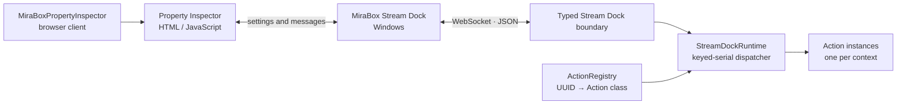

<div align="center">
  <p><strong>English</strong> · <a href="https://github.com/Nekit678/MiraboxStreamDockSDK/blob/main/README.ru.md">Русский</a></p>
  
  <h1>MiraBox Stream Dock SDK</h1>
  <p><strong>A typed Python SDK for building MiraBox Stream Dock plugins</strong></p>
  <p>
    <a href="https://pypi.org/project/mirabox-stream-dock-sdk/"></a>
    <a href="https://www.python.org/downloads/"></a>
    
    <a href="https://github.com/Nekit678/MiraboxStreamDockSDK/actions/workflows/ci.yml"></a>
    <a href="https://github.com/Nekit678/MiraboxStreamDockSDK/blob/main/LICENSE"></a>
  </p>
  <p>
    Build reusable actions for keys, touch panels, and dials<br>
    without hand-writing the Stream Dock WebSocket protocol.
  </p>
  <p>
    <a href="#quick-start">Quick start</a> ·
    <a href="https://pypi.org/project/mirabox-stream-dock-sdk/">PyPI</a> ·
    <a href="#counter-example-plugin">Example plugin</a> ·
    <a href="#protocol-basis">Protocol</a> ·
    <a href="#api-overview">API</a> ·
    <a href="#development">Development</a>
  </p>
</div>

---

## About

`mirabox-stream-dock-sdk` provides the protocol, runtime, and browser-side tools
needed to build Python plugins for MiraBox Stream Dock. It validates launch
arguments and incoming messages, creates one typed action instance per visible
control, dispatches lifecycle events, and serializes commands back to the
Stream Dock application.

The SDK was originally developed as part of a Stream Dock plugin. It was later
extracted into a standalone project so the protocol and runtime could be reused
across plugins, tested independently, and evolved as a public package. The SDK
will continue to be improved as it is used in real plugins and more Stream Dock
behavior is verified.

> [!IMPORTANT]
> The project is currently in the `0.x` series. It is ready for experimentation
> and real plugin development, but public APIs may evolve between minor releases
> before `1.0`.

> [!NOTE]
> This is an unofficial community project and is not affiliated with or endorsed
> by MiraBox, HotSpot, or Elgato. The callback name
> `connectElgatoStreamDeckSocket` is retained because Stream Dock uses it for
> Property Inspector compatibility.

## Table of contents

- [Features](#features)
- [How it works](#how-it-works)
- [Requirements](#requirements)
- [Installation](#installation)
- [Quick start](#quick-start)
- [Property Inspector client](#property-inspector-client)
- [Counter example plugin](#counter-example-plugin)
- [Protocol basis](#protocol-basis)
- [API overview](#api-overview)
- [Errors and unknown events](#errors-and-unknown-events)
- [Inbound event queue](#inbound-event-queue)
- [Outbound command bus](#outbound-command-bus)
- [Concurrency contract](#concurrency-contract)
- [Logging](#logging)
- [Project structure](#project-structure)
- [Development](#development)
- [Releasing](#releasing)

## Features

| | Feature | What it provides |
|:--:|---|---|
| 🧩 | Typed protocol | Dataclass models for registration, commands, and key, touch, dial, device, application, and settings events. |
| 🧭 | Precise validation | Malformed payloads report the event name and exact JSON field path that failed validation. |
| 🎛️ | Action runtime | One action instance per Stream Dock context, declarative UUID registration, and automatic lifecycle dispatch. |
| 🔌 | WebSocket transport | Registration, message parsing, command serialization, logging, and graceful shutdown. |
| 🗃️ | Typed settings | Pluggable codecs for action settings, global settings, and Property Inspector messages. |
| 🖥️ | Property Inspector | A versioned, dependency-free JavaScript client with connection state, events, settings helpers, and queued startup messages. |
| 🧰 | Plugin services | Start and stop plugin-owned background services in a predictable order. |
| 📦 | Distribution tooling | A CLI resource copier, PyInstaller example, package verification, CI, and Trusted Publishing workflow. |
| 🛡️ | Forward compatibility | Unknown but valid events can be preserved as `UnknownStreamDockEvent` instead of breaking the plugin. |

## How it works


```mermaid
flowchart LR
    App["MiraBox Stream Dock<br>Windows"] <-->|"WebSocket · JSON"| Boundary["Typed Stream Dock boundary"]
    Boundary --> Runtime["StreamDockRuntime<br>keyed-serial dispatcher"]
    Registry["ActionRegistry<br>UUID → Action class"] --> Runtime
    Runtime --> Actions["Action instances<br>one per context"]
    PI["Property Inspector<br>HTML / JavaScript"] <-->|"settings and messages"| App
    Client["MiraBoxPropertyInspector<br>browser client"] --> PI
```

Stream Dock starts the packaged plugin executable with the WebSocket port,
plugin UUID, registration event, and application metadata. `run_plugin_cli()`
parses those arguments, while `create_stream_dock_application()` composes the
typed boundary and runtime that register the plugin and route incoming events.

## Requirements

- Python `3.11+`;
- MiraBox Stream Dock `2.10.179.426` or newer (declared minimum);
- `websocket-client>=1.8,<2` (installed automatically);
- Windows to run Stream Dock and package a standalone plugin with PyInstaller.

The SDK's Stream Dock integration has been manually verified with Stream Dock
`3.10.203.0701`.

The SDK itself and its test suite can be developed on Windows, Linux, or WSL.
The final `.exe` must be built on Windows because PyInstaller is not a
cross-compiler.

## Installation

Install the released package from PyPI:

```bash
python -m pip install mirabox-stream-dock-sdk
```

To work on the SDK from source:

```bash
git clone https://github.com/Nekit678/MiraboxStreamDockSDK.git
cd MiraboxStreamDockSDK
python -m venv .venv
```

<details>
<summary><strong>Windows PowerShell</strong></summary>

```powershell
.venv\Scripts\Activate.ps1
python -m pip install --upgrade pip
python -m pip install -e ".[dev]"
```

</details>

<details>
<summary><strong>Linux / WSL</strong></summary>

```bash
source .venv/bin/activate
python -m pip install --upgrade pip
python -m pip install -e ".[dev]"
```

</details>

## Quick start

Define dependencies shared by your action instances, register each action UUID,
and return a configured `StreamDockApplication` from the application factory:

```python
from __future__ import annotations

from dataclasses import dataclass

from mirabox_sdk import (
    Action,
    ActionRegistry,
    JsonObject,
    KeyDownEvent,
    PluginLaunchArguments,
    StreamDockApplication,
    StreamDockSender,
    WillAppearEvent,
    create_stream_dock_application,
    run_plugin_cli,
)

ACTION_UUID = "com.example.counter.increment"


@dataclass(frozen=True, slots=True)
class Dependencies:
    stream_dock: StreamDockSender


registry: ActionRegistry[Dependencies] = ActionRegistry()


@registry.register(ACTION_UUID)
class CounterAction(Action[JsonObject, Dependencies]):
    def _render(self) -> None:
        count = self.settings.get("count", 0)
        self.set_title(str(count if type(count) is int else 0))

    def on_will_appear(self, _event: WillAppearEvent) -> None:
        self._render()

    def on_key_down(self, _event: KeyDownEvent) -> None:
        count = self.settings.get("count", 0)
        self.set_settings({"count": (count if type(count) is int else 0) + 1})
        self._render()


def build_application(arguments: PluginLaunchArguments) -> StreamDockApplication:
    return create_stream_dock_application(
        arguments,
        action_factory=registry,
        action_dependencies_factory=lambda ctx: Dependencies(ctx.stream_dock),
    )


if __name__ == "__main__":
    raise SystemExit(run_plugin_cli(build_application))
```

The exact same action UUID must appear in the plugin's `manifest.json`. Stream
Dock creates and removes action contexts through `willAppear` and
`willDisappear`; the runtime manages the corresponding Python instances.

`ActionRegistry[Dependencies].register()` checks that the action constructor
accepts the registry's dependency type and preserves the concrete action class,
including its own methods and settings type. Its return annotation is the
public `ActionRegistration[Dependencies]` protocol. Incompatible dependency
containers are reported by the type checker when the action is registered.

### Action callbacks

Override only the callbacks an action needs:

| Input or lifecycle | `Action` callback |
|---|---|
| Action becomes visible or disappears | `on_will_appear`, `on_will_disappear` |
| Key press or release | `on_key_down`, `on_key_up` |
| Touch panel tap | `on_touch_tap` |
| Dial press, release, or rotation | `on_dial_down`, `on_dial_up`, `on_dial_rotate` |
| Settings or title parameters change | `on_did_receive_settings`, `on_title_parameters_did_change` |
| Property Inspector opens, closes, or sends data | `on_property_inspector_did_appear`, `on_property_inspector_did_disappear`, `on_send_to_plugin` |
| Device, application, and wake-up notifications | `on_device_did_connect`, `on_device_did_disconnect`, `on_application_did_launch`, `on_application_did_terminate`, `on_system_did_wake_up` |

Action helper methods cover the common outbound commands: `set_title()`,
`set_image()`, `set_state()`, `set_settings()`, `get_settings()`, `show_ok()`,
`show_alert()`, `open_url()`, `log_message()`, and
`send_to_property_inspector()`. Display-only updates also have non-blocking
`set_title_async()`, `set_image_async()`, and `set_state_async()` variants.

### Typed settings

Actions use JSON objects by default. To work with an application-specific type,
provide a `JsonCodec` on the action class:

```python
from dataclasses import dataclass

from mirabox_sdk import Action, FunctionalJsonCodec, JsonObject


@dataclass(frozen=True, slots=True)
class CounterSettings:
    count: int


def decode_settings(value: JsonObject) -> CounterSettings:
    count = value.get("count", 0)
    if type(count) is not int:
        raise ValueError("count must be an integer")
    return CounterSettings(count)


COUNTER_SETTINGS_CODEC = FunctionalJsonCodec(
    decoder=decode_settings,
    encoder=lambda value: {"count": value.count},
)


class CounterAction(Action[CounterSettings, Dependencies]):
    settings_codec = COUNTER_SETTINGS_CODEC
```

The codec boundary verifies that encoded values are valid JSON. Decode errors
are wrapped with the relevant event name and settings path.

### Global settings

`application.global_settings` is the one runtime-owned facade shared by the
application and context-aware action-dependency and service factories. Use
`update()` when several in-memory changes belong to one logical operation. The
callback works on an isolated draft; an exception or invalid JSON result rolls
back the complete update:

```python
def append_items(settings: JsonObject) -> None:
    items = settings.get("items")
    if not isinstance(items, list):
        raise ValueError("items must be a list")
    items.extend(values)


application.global_settings.update(append_items)
```

After the callback succeeds, the transaction validates the complete draft and
persists it with one `setGlobalSettings` command. Callback, validation, and send
failures leave the previous local state unchanged. `snapshot()` returns an
isolated copy, so changing it never changes the runtime state. Use `set()` or
`set_typed()` for complete replacements. The facade exposes no mutable
`settings` property; read the current value through `snapshot()`.

## Property Inspector client

Copy the JavaScript client shipped with the installed SDK into the plugin
bundle:

```bash
mirabox-sdk copy-property-inspector \
  com.example.counter.sdPlugin/property-inspector
```

The command refuses to overwrite a different copy by default. Pass `--force`
when intentionally updating the bundled client.

Load it before the action-specific script:

```html
<script src="mirabox-sdk.js"></script>
<script src="counter.js"></script>
```

Stream Dock invokes the compatibility callback automatically. The action script
uses the shared client through `window.MiraBoxPropertyInspector`:

```javascript
const client = window.MiraBoxPropertyInspector;

client.on("connected", ({ settings }) => {
  console.log("Current settings", settings);
  client.sendToPlugin({ event: "refresh" });
  client.updateSettings({ mode: "toggle" });
});

client.on("didReceiveSettings", ({ payload }) => {
  console.log("Updated settings", payload.settings);
});
```

The client exposes `on()`, `off()`, `send()`, `sendToPlugin()`, `setSettings()`,
`updateSettings()`, and `getSettings()`, plus connection and registration state.
Messages sent while the WebSocket is connecting are queued until it opens.
Start application work in `connected`: calls before the host invokes the
connection callback or after the socket starts closing throw an `Error`.
Send methods return `true` for an immediate send and `false` only for an
accepted queued message. Invalid JSON data (including cycles and `BigInt`)
throws before acceptance; immediate `WebSocket.send()` errors propagate.

Frames are limited to 8 MiB of UTF-8 JSON, including their envelope. While
connecting, the FIFO accepts at most 1,024 messages and 16 MiB of wire bytes.
Exceeding any limit throws `RangeError` before acceptance and leaves local
settings unchanged. Accepted messages retain their order and are not replaced
automatically. `client.queueMetrics` reports limits, current/peak depth and
bytes, and `rejectedFull`/`rejectedOversized`. Flush and close release the budget.
Oversized incoming frames emit `protocolError` before JSON parsing.

Queued messages own serialized JSON snapshots. Deferred send failures emit
`sendError` with `{ message, error }` for each unsent message, including when
the socket closes before flushing. A failed message does not prevent later
messages from being attempted; failed registration closes the socket without
emitting `connected`. Sends are not retried automatically.

`settings` returns a deep JSON copy. Local settings change only when a send is
accepted and remain optimistic until `didReceiveSettings` refreshes them;
neither acceptance nor `connected` confirms host persistence. Deferred failures
do not roll back accepted local settings. Listen for `sendError` and request a
fresh snapshot with `getSettings()` while connected if reconciliation is needed.

Validate the assembled bundle before installing it:

```bash
mirabox-sdk validate-plugin com.example.counter.sdPlugin \
  --registry counter_plugin.bootstrap:ACTION_REGISTRY
```

The registry module must be importable in the current Python environment and
load every action registration without starting the plugin. `--registry`
imports that module and compares the UUID sets in both directions. Without it,
the command checks manifest UUID syntax and duplicates and reports that the
registry comparison was skipped.

Validation checks required manifest fields and known optional field types,
`CodePath`/platform variants, icons, state images, Property Inspector pages and
their local script/link/image references. Files must stay inside the bundle.
Internal directory symlinks are supported; each resolved directory is scanned
once, including when links form cycles. Symlinks outside the bundle are errors
and their targets are not inspected. Unresolvable links and directory read
errors are reported as diagnostics.
Every bundled `mirabox-sdk.js` must match the installed SDK byte for byte;
refresh stale or modified copies with `copy-property-inspector --force`.
Errors include a field or file path and return exit code `1`; success returns
`0`. The Python equivalent is
`validate_plugin(bundle_path, action_uuids=registry.action_uuids)`, exported from
`mirabox_sdk`, which returns a tuple of diagnostics (empty on success).

Unknown manifest fields are accepted. Validation does not run the executable,
check image dimensions, fetch remote resources, resolve dynamic JavaScript
imports or prove compatibility with Stream Dock. Validate after packaging:
the Counter source bundle intentionally lacks `CounterPlugin.exe`.

## Counter example plugin

[`examples/counter_plugin`](https://github.com/Nekit678/MiraboxStreamDockSDK/tree/main/examples/counter_plugin)
is a complete plugin rather
than an isolated code fragment. It includes:

- a package with a registered counter action;
- a Property Inspector that can reset the counter;
- a valid `.sdPlugin` bundle and manifest;
- SVG assets and a PyInstaller specification;
- tests for the plugin behavior.

Build its executable on Windows:

```powershell
python -m pip install pyinstaller
python -m PyInstaller --clean --noconfirm examples/counter_plugin/build.spec
Copy-Item dist\CounterPlugin.exe `
  examples\counter_plugin\com.example.counter.sdPlugin\
```

Copy the resulting `com.example.counter.sdPlugin` directory to
`%APPDATA%\HotSpot\StreamDock\plugins\` and restart Stream Dock. See the
[example guide](https://github.com/Nekit678/MiraboxStreamDockSDK/blob/main/examples/counter_plugin/README.md)
for a source-run command and
the complete packaging flow.

## Protocol basis

This package is an independent, typed Python implementation of the WebSocket /
JSON plugin API published by MiraBox. The primary upstream sources are:

- the [official StreamDock Plugin SDK repository](https://github.com/MiraboxSpace/StreamDock-Plugin-SDK),
  including its [Python template](https://github.com/MiraboxSpace/StreamDock-Plugin-SDK/tree/main/SDPythonSDK);
- the official [registration procedure](https://sdk.key123.vip/en/guide/registration.html),
  [received events](https://sdk.key123.vip/en/guide/events-received.html), and
  [events sent](https://sdk.key123.vip/en/guide/events-sent.html) reference;
- the official [`manifest.json` reference](https://sdk.key123.vip/en/guide/manifest.html)
  and [Property Inspector guide](https://sdk.key123.vip/en/guide/property-inspector.html);
- the [upstream template overview on DeepWiki](https://deepwiki.com/MiraboxSpace/StreamDock-Plugin-SDK)
  for secondary, generated explanations of the repository;
- the [Space Platform](https://space.key123.vip/) for publishing completed
  Stream Dock plugins.

The local [protocol map](https://github.com/Nekit678/MiraboxStreamDockSDK/blob/main/docs/PROTOCOL.md)
connects each supported wire event
and command to its Python model or helper and calls out behavior verified in
Stream Dock but not currently listed in the upstream event reference. When the
published documentation and observed runtime behavior differ, tests record the
behavior implemented by this SDK.

## API overview

| Area | Public API |
|---|---|
| Runtime | `StreamDockApplication`, `ApplicationRuntime`, `ApplicationContext`, `ApplicationService`, `SessionReadiness`, `create_stream_dock_application`, `RuntimeDispatcherConfig`, runtime metrics and ports |
| Actions | `Action`, `ActionRegistry`, `StreamDockSender` |
| Launch and registration | `PluginLaunchArguments`, registration dataclasses, `parse_plugin_cli_arguments`, `run_plugin_cli` |
| Input events | Typed immutable event models and `InboundOverflowPolicy` |
| Output commands | Registration, settings, title, image, state, feedback, URL, log, and Property Inspector command models; `ValidatedWireMessage` |
| Application data | `JsonCodec`, `FunctionalJsonCodec`, `JsonObjectCodec`, `ValidatedJsonObject`, `OwnedJsonPayload`, typed encode/decode helpers |
| Resources and bundles | `copy_property_inspector_client`, `property_inspector_client_bytes`, `validate_plugin`, `mirabox-sdk` CLI |
| Parsing | `parse_stream_dock_event`, `parse_registration_info`, typed protocol errors |
| Logging | `configure_logging` with isolated console, file, and disable controls |

The supported public surface is exported from `mirabox_sdk`. Objects from
individual modules should be treated as implementation details unless they are
also exported there. The testing helpers are exported separately from
`mirabox_sdk.testing`.

Supported imports are `mirabox_sdk` and, for the documented runtime namespace,
`mirabox_sdk.runtime`; tests can use `mirabox_sdk.testing`. In the breaking
`0.5.0` release, the unsupported direct legacy modules (`connection`, `inbound`, `outbound`, `plugin`, and `stores`) and
the temporary `mirabox_sdk._next` namespace were removed from distributions.

`ApplicationRuntime` is the complete contract used by
`StreamDockApplication.runtime`; `RuntimeLifecycle` is deliberately narrower
and cannot be passed to `StreamDockApplication`. Application composition accepts
`ActionRegistry` or the public `DependencyAwareActionRegistry` protocol. Scheduler
selection uses `RuntimeDispatcherConfig`; transport and scheduler adapters and the
concrete runtime are internal implementation details.

The unreleased API removes the `ActionFactory`, `HandlerSchedulerFactory`,
`WebSocketConnectorFactory`, `StreamDockRuntime`, and
`StreamDockRuntimeLifecycleError` exports, and the `connector_factory` /
`scheduler_factory` application parameters. Replace test connectors with
`mirabox_sdk.testing.StreamDockHarness`, and use `ApplicationRuntime` for runtime
facades. Imports from `mirabox_sdk._internal` remain unsupported.

All metric snapshot types, including `CommandWriterMetrics`, `EventReaderMetrics`,
`InboundEventQueueMetrics`, `OutboundCommandQueueMetrics`, `TransportQueueMetrics`,
and `WebSocketConnectorMetrics`, are importable from `mirabox_sdk` and
`mirabox_sdk.runtime`.

## Testing plugins

`StreamDockHarness` replaces socket I/O with in-memory frames while exercising
the production registration, settings, codecs, queues and action dispatcher.
Pass the same launch arguments and factories used by your application:

```python
from mirabox_sdk import (
    Action,
    ActionRegistry,
    ApplicationContext,
    JsonObject,
    PluginLaunchArguments,
    WillAppearEvent,
)
from mirabox_sdk.testing import StreamDockHarness

registry = ActionRegistry[ApplicationContext]()


@registry.register("com.example.test.action")
class TestAction(Action[JsonObject, ApplicationContext]):
    def on_will_appear(self, event: WillAppearEvent) -> None:
        self.set_title("ready")


def test_application(arguments: PluginLaunchArguments) -> None:
    with StreamDockHarness(
        arguments,
        action_factory=registry,
        action_dependencies_factory=lambda ctx: ctx,
    ) as harness:
        harness.assert_registration()
        harness.send_event(
            "willAppear",
            action="com.example.test.action",
            context="button",
            device="device",
            payload={
                "settings": {},
                "coordinates": {"column": 0, "row": 0},
                "isInMultiAction": False,
                "controller": "Keypad",
            },
        )
        harness.wait_for_events(1)
        harness.assert_command(
            "setTitle", context="button", payload={"title": "ready", "target": 0}
        )
```

Context entry starts the application, connects, and waits for registration and
the initial global-settings request. It does not wait for a settings response or
for background work started by `Plugin.on_ready()`. `wait_for_events(n)` waits
for `n` acknowledged events since startup. Context exit joins the harness
threads and reports runtime/service failures; plugin callback failures retain
the runtime's normal isolation behavior.

Use `start(connect=False)`, `connect()`, and `wait_ready()` for pre-ready tests.
`send_json()` accepts JSON objects or raw text, including malformed input;
`receive()` consumes the next outbound message, while `messages` and `frames`
retain the complete output history. Waits and `stop()` have finite timeouts;
a timeout reports incomplete work and cannot interrupt user callback code.

For isolated action tests, inject `FakeStreamDockSender` from
`mirabox_sdk.testing` as the dependency's `stream_dock`. Its `messages` property
returns isolated wire snapshots; `send_async()` returns a completed public
`CommandFuture`, including serialization failures. See the
[Counter tests](examples/counter_plugin/tests/test_counter_plugin.py) for both
unit and application examples.

## Application services

Extend the quick-start factory with `ApplicationService` implementations for
repositories, HTTP clients, background workers, and other resources required
by action callbacks:

```python
from dataclasses import dataclass

from mirabox_sdk import (
    ApplicationContext,
    GlobalSettings,
    LogMessageCommand,
    PluginLaunchArguments,
    StreamDockApplication,
    StreamDockSender,
    create_stream_dock_application,
)


class Repository:
    def start(self) -> None:
        ...

    def stop(self) -> None:
        ...


@dataclass(frozen=True, slots=True)
class Dependencies:
    stream_dock: StreamDockSender
    global_settings: GlobalSettings


def build_dependencies(context: ApplicationContext) -> Dependencies:
    return Dependencies(
        stream_dock=context.stream_dock,
        global_settings=context.global_settings,
    )


def build_repository(_context: ApplicationContext) -> Repository:
    return Repository()


def build_application(arguments: PluginLaunchArguments) -> StreamDockApplication:
    return create_stream_dock_application(
        arguments,
        action_factory=registry,
        action_dependencies_factory=build_dependencies,
        service_factories=(build_repository,),
    )
```

`ApplicationContext` is immutable and shared by all plugin, dependency, and service
factories. It provides the same `stream_dock`, `global_settings`,
`session_readiness`, and `stop_signal` objects to each collaborator, without mutable
wiring or internal imports.

`action_dependencies_factory` always receives `ApplicationContext`, regardless
of parameter names or annotations. Wrap an existing sender-only factory as
`action_dependencies_factory=lambda ctx: old_factory(ctx.stream_dock)`.
For migration, `legacy_action_dependencies_factory=old_factory` still passes
only `StreamDockSender` and emits `DeprecationWarning`. The two factory
parameters are mutually exclusive.

Services start in declaration order before the WebSocket runtime connects and
stop in reverse order after it finishes. If startup fails, only services that
started successfully are stopped. Cleanup always attempts every started
service; a primary startup or runtime failure is preserved. `stop()` may still
be called from an action callback. Service cleanup runs on an application-owned
cleanup worker after runtime resources are released; after a shutdown timeout it
can continue after `run()` returns. Workers should observe
`context.stop_signal.requested` or `context.stop_signal.wait(timeout)` to exit
cooperatively before resources are closed.

`ApplicationService.start()` is a process-start phase only. The outbound writer
is not running there, so services must not call `StreamDockSender`, synchronous
global-settings setters, or block on `context.session_readiness.wait()`. Those
command calls fail immediately with `OutboundCommandBusNotReadyError`. A service
that needs Stream Dock I/O should start its own worker, have that worker wait on
`context.session_readiness`, and send only when `wait()` returns `True`:

```python
def run_session_work(context: ApplicationContext) -> None:
    if context.session_readiness.wait():
        context.stream_dock.send(LogMessageCommand("session is ready"))
```

The readiness signal opens after the transport connects and the registration
and initial global-settings-request commands complete. It does not wait for the
first global-settings response; use `context.global_settings.loaded` for that
separate state. If session initialization fails or ends before readiness,
`wait()` returns `False`; inspect `failure` to distinguish an initialization
error from normal closure.

## Plugin callbacks

Subclass `Plugin` to observe plugin-wide broadcast events independently of
active actions. Pass `plugin_factory=MyPlugin` to
`create_stream_dock_application()` to receive the same `ApplicationContext`
as action-dependency and service factories:

```python
from mirabox_sdk import ApplicationContext, LogMessageCommand, Plugin, SystemDidWakeUpEvent


class MyPlugin(Plugin):
    def __init__(self, context: ApplicationContext) -> None:
        self.context = context

    def on_ready(self) -> None:
        self.context.stream_dock.send(LogMessageCommand("session is ready"))

    def on_system_did_wake_up(self, event: SystemDidWakeUpEvent) -> None:
        refresh_shared_state()
```

An already-constructed instance is still accepted as `plugin=existing_plugin`.
`plugin`, `plugin_factory`, and legacy `plugin_hooks` are mutually exclusive.
The factory runs once during composition, before services or the runtime start;
it must return a `Plugin` and must not send commands or wait for readiness.
Construction errors close the boundary and propagate to the caller.

`on_ready()` runs once after registration and the initial global-settings request
complete, before any inbound protocol callbacks. It can send commands and use
the canonical global-settings facade without waiting or creating a service.
It does not wait for the first settings response. Return promptly and start
an owned worker for ongoing work. Override `on_stop()` to signal and join that
worker: the runtime calls it once after releasing actions and before stopping
application services, including when `on_ready()` raised after partial startup.
The transport is already closed at that point. Neither callback runs if the
session never reaches readiness. If a callback shutdown wait expires, action
cleanup, `on_stop()` and service cleanup are deferred until callbacks finish.
Resources remain allocated while work is unfinished.

Session callback exceptions are logged with the callback name and exception
type, without exception messages, and isolated from protocol delivery and
cleanup. `on_stop()` failures also appear in `shutdown_outcome.cleanup_failures`.
They do not replace a primary runtime failure. Routing metrics and
dispatch results describe wire-event callbacks only.

The runtime invokes the plugin callback first, then the stable snapshot of
active action callbacks. Global-settings state is updated before either
callback and each recipient receives an isolated settings event. A plugin
wire-event callback failure is logged and reported in runtime metrics/result
policy, but does not prevent active actions from receiving the event. `PluginHooks` remains
supported for its legacy `on_unhandled_event()`-only contract.

## Errors and unknown events

| Exception | Meaning |
|---|---|
| `InvalidPluginLaunchArgumentsError` | Stream Dock did not provide valid executable arguments. |
| `InvalidRegistrationInfoError` | The registration metadata JSON has an invalid field. |
| `MalformedEventError` / `InvalidFieldError` | A known event is malformed; the error includes its JSON path. |
| `UnsupportedEventError` | An unknown event was parsed with `allow_unknown=False`. |
| `JsonCodecDecodeError` | Plugin-owned settings or messages could not be decoded. |
| `JsonCodecEncodeError` | A codec produced a value that cannot be sent as JSON. |
| `OutboundQueueFullError` | The bounded outbound command queue is full. |
| `OutboundCommandBusNotReadyError` | A command was submitted before the outbound writer started. |
| `OutboundCommandBusClosedError` | A command was submitted after outbound shutdown began. |

By default, `parse_stream_dock_event()` preserves an unknown but structurally
valid envelope as `UnknownStreamDockEvent`. This lets the SDK tolerate protocol
extensions while known events remain strictly validated. The runtime delivers
each preserved event once to the configured `Plugin` or legacy `PluginHooks`
object. Unknown envelopes are not broadcast to actions because their routing
semantics are not known yet.

Protocol parsing metadata and runtime routing metadata are maintained in
separate validated internal registries. The public API exposes typed event
models rather than registry implementation details.

## Inbound event queue

The typed boundary parses frames outside application callbacks and puts valid
events into a bounded queue. A keyed-serial worker pool invokes action
callbacks: one action context remains strictly ordered, while different
contexts can make progress concurrently. `willAppear`, `willDisappear`,
broadcast, and unknown events are exclusive ordering barriers; each waits for
earlier context callbacks and completes before later callbacks start. On normal
shutdown, the queue drains before `StreamDockApplication.run()` returns and
before the runtime releases actions.

The default runtime keeps excess events for a busy context in this bounded
source queue and admits other contexts from the segment before the next barrier.
With pending limit `P` (`scheduler_pending_limit`, default 64) and `W` workers,
each context may hold at most `max(1, P // W)` pending plus running events
without a global barrier.
The total scheduler pending limit still applies. No intermediate event buffer
is added: source, pending, running, and one pump handoff retain at most
`inbound_event_limit + P + W + 1` events. A different context already in the
source can therefore reach an idle worker despite a hot-context burst. Global
barriers and backpressure before an event enters a full source still apply.

The pool defaults to four workers and the queue defaults to 1,024 events.
Lifecycle, settings, input, broadcast, unknown, and every other event except
`dialRotate` are lossless by default. `dialRotate` is explicitly coalescable
and may be discarded on overflow. Configure worker concurrency, the limit, and
overflow behavior for discardable events when constructing the application:

```python
from mirabox_sdk import (
    InboundOverflowPolicy,
    RuntimeDispatcherConfig,
    StreamDockQueueConfig,
    create_stream_dock_application,
)

application = create_stream_dock_application(
    arguments,
    action_factory=registry,
    action_dependencies_factory=build_dependencies,
    queue_config=StreamDockQueueConfig(
        raw_inbound_limit=512,
        inbound_event_limit=512,
        outbound_command_limit=512,
        raw_outbound_limit=512,
        session_event_limit=16,
    ),
    runtime_config=RuntimeDispatcherConfig(worker_count=4),
    inbound_overflow_policy=InboundOverflowPolicy.DROP_OLDEST,
    coalesce_dial_rotations=True,
)
```

`DROP_NEWEST` (the default) discards the newest eligible `dialRotate`;
`DROP_OLDEST` discards the oldest eligible rotation. Neither policy may evict a
lossless event. If the queue contains only lossless events, another lossless
event applies backpressure to the WebSocket reader until the dispatcher frees
space; an incoming rotation is discarded instead. This keeps memory bounded
without allowing overflow to corrupt runtime state.

Rotation coalescing is opt-in: compatible pending `dialRotate` events for the
same context and pressed state are combined by summing `ticks`; an intervening
event for that context, or any broadcast/unknown event, prevents coalescing.

Read `application.metrics()` for immutable queue, event-pump, scheduler, route,
action, session, and transport snapshots. `RuntimeDispatcherConfig.shutdown_timeout`
sets one total shutdown waiting budget (five seconds by default), shared by
boundary, runtime and service cleanup. Each stage receives the lesser of its
own timeout and the remaining budget. Set the total timeout to `None` only
when an unbounded overall wait is intended.

`callback_drain_timeout` limits the scheduler's shutdown drain wait. The old
`callback_timeout` name remains supported with a `DeprecationWarning`; the two
names are mutually exclusive. Neither setting monitors or interrupts callbacks
during normal operation. Bound external I/O separately.

`ApplicationContext.stop_signal` is set before shutdown starts closing resources,
on local stop, remote disconnect or fatal failure. Background work can use its
`requested` property or `wait(timeout)` method for cooperative cancellation.
Python cannot safely stop an arbitrary running thread. After a timeout the
caller can return while daemon work continues; action release, plugin stop and
service stop remain ordered after all callbacks and boundary workers finish.
Slow cleanup also continues in its owned daemon worker, without releasing
resources needed by earlier unfinished cleanup. Deferred cleanup cannot be
guaranteed if the process exits first.

`application.shutdown_outcome` is `None` before shutdown and otherwise returns
an immutable `ShutdownOutcome` snapshot. `complete`, `workers_stopped`,
`unfinished_callbacks` and `pending_cleanup` distinguish finished work from
work still running. `cleanup_failures` contains `ShutdownFailure(stage, error)`
with original exceptions; `timed_out_stages`, `callback_timeouts`,
`discarded_events` and `discarded_commands` retain shutdown diagnostics. Event
counts include typed-queue and scheduler discards; command counts include
command-queue and writer discards. Read a new snapshot to observe deferred
cleanup; old snapshots never change. `successful` requires completion without
failures or timeouts. The first fatal runtime failure remains primary, with
cleanup stages attached as exception notes. `SystemExit` and other unexpected
worker exits are fatal errors retaining the original exception in `__cause__`;
the owned event still reaches terminal acknowledgement.

Cleanup errors retain the existing exception policy for `run()`/`stop()`;
service-stop errors completed within the waiting budget still propagate when
there is no primary failure. `run_plugin_cli()` returns `1` for an unsuccessful
shutdown outcome, including unfinished workers or cleanup failures.

## Outbound command bus

Every `StreamDockApplication` owns one dedicated outbound writer.
Calling `send()` puts the typed command into a bounded FIFO queue; only that
writer validates and serializes the command, emits its protocol log, and calls
the WebSocket transport. Concurrent plugin threads therefore cannot interleave
frames. `send()` waits for its command's result, so serialization and transport
errors still reach the caller and state-update helpers retain their rollback
behavior.

`send_async()` performs the same queue acceptance but returns a
`CommandFuture` before serialization or WebSocket I/O. Queue-full, pre-start,
and shutdown rejections are raised immediately; call `future.result()` only
when the eventual writer-side error or completion matters. Before `run()` has
started the command writer, both `send()` and `send_async()` raise
`OutboundCommandBusNotReadyError` and do not enqueue a command. For
high-frequency display rendering, `Action.set_image_async()`,
`set_title_async()`, and `set_state_async()` avoid holding an inbound callback
while the writer is slow. Rollback-sensitive settings helpers remain
synchronous.

`future.result(timeout=...)` re-raises the original command failure, including
a transport `TimeoutError`. Only an expired wait raises
`TimeoutError("Outbound command did not complete before the timeout")`; it does
not cancel the command, and a later call can retrieve its terminal result.

The outbound queue holds 1,024 waiting commands by default. It never silently
drops a command when full: `send()` and `send_async()` raise
`OutboundQueueFullError`. Configure its capacity together with the other
boundary limits:

```python
from mirabox_sdk import StreamDockQueueConfig, create_stream_dock_application

application = create_stream_dock_application(
    arguments,
    action_factory=registry,
    action_dependencies_factory=build_dependencies,
    queue_config=StreamDockQueueConfig(
        raw_inbound_limit=512,
        inbound_event_limit=512,
        outbound_command_limit=512,
        raw_outbound_limit=512,
        session_event_limit=16,
    ),
    coalesce_commands=True,
)
```

Coalescing is opt-in. Compatible adjacent pending `setState`, `setTitle`,
`setImage`, `setSettings`, or `setGlobalSettings` commands for the same
semantic target are replaced by their newest value. Commands of another type or
target are ordering barriers. All callers whose commands were combined receive
distinct `CommandFuture` handles backed by the queued command's single
completion state, and therefore observe the same final write result. The queue
retains at most one completion state per physical entry.

Raw frame queues default to 16 MiB of UTF-8 wire bytes each, with an 8 MiB
limit per frame. Configure `StreamDockQueueConfig.max_message_bytes`,
`raw_inbound_byte_limit`, `inbound_event_byte_limit`,
`outbound_command_byte_limit`, and `raw_outbound_byte_limit` using positive
integers. The typed queue byte limits also default to 16 MiB each. They estimate
retained Python DTO/JSON bytes with `sys.getsizeof()`, including copy-on-write
backing storage, without serializing on the submitting thread.

Outbound submissions that exceed either capacity raise `OutboundQueueFullError`
synchronously. Raw outbound frame rejection completes the command future with
an error. An item larger than its queue's entire byte budget is rejected
immediately. Inbound byte pressure follows the existing backpressure/rotation
drop policy. Coalescing must fit the byte budget before changing an entry.
Queue metrics include `byte_limit`, `current_bytes`, `peak_bytes`, and
`rejected_oversized`; receiving or discarding an entry releases its bytes.

The keyed scheduler also limits pending retained bytes to 16 MiB; configure
`RuntimeDispatcherConfig.scheduler_pending_byte_limit` alongside the inbound
budget when increasing limits. Scheduler metrics expose `pending_byte_limit`,
`current_pending_bytes`, `peak_pending_bytes`, and `rejected_oversized`.
An event exceeding the entire scheduler budget receives a terminal error;
the application reports it as a runtime failure. Sequential dispatch has no
pending event buffer.

These budgets cover queued content. Shared objects are counted separately in
different entries; queue/completion bookkeeping, active workers, allocator
overhead, and opaque native allocations are outside the budgets, so they do not
define a process RSS limit. Keep submitted DTOs unchanged until processing
completes. The WebSocket library receives complete frames before the SDK checks
them, and constructing payloads or serializing a frame can also allocate
temporary memory before rejection.

Read `application.metrics().boundary` for atomic outbound queue, writer, raw
transport, and connector snapshots. Before writer startup, submissions raise
`OutboundCommandBusNotReadyError`; once outbound command shutdown starts, they
raise `OutboundCommandBusClosedError`. Accepted commands receive exactly one
terminal result through the canonical `CommandFuture`.

## Concurrency contract

The runtime uses explicit thread ownership:

| Surface | Supported caller or owner |
|---|---|
| `configure_logging()` and `StreamDockApplication.run()` / `stop()` | Application lifecycle thread; configure logging before `run()`; `stop()` is idempotent and may also be called concurrently |
| WebSocket frame I/O and typed protocol parsing | Boundary-owned transport/codec workers |
| Wire-event callbacks on `Action`, `Plugin`, and `PluginHooks` | Runtime-owned keyed workers; callbacks are serial per context and may overlap across contexts, while lifecycle, broadcast, and unknown barriers run exclusively |
| `Plugin.on_ready()` | Runtime event-pump thread, after session readiness and before inbound protocol callbacks |
| `Plugin.on_stop()` | Runtime cleanup worker, after action cleanup and before application services stop |
| `StreamDockSender.send()` / `send_async()` and action command helpers | Any application, service, or action-callback thread after the outbound writer starts; overlapping calls are supported |
| `StreamDockApplication.stop()` | Any application or action-callback thread; calls are idempotent and may overlap |

The outbound queue establishes FIFO order when it accepts commands. Calls that
do not overlap retain caller order; the relative order of simultaneous calls
is intentionally unspecified. Each `send()` waits only for its own accepted
submission (or the final coalesced write) and receives its serialization,
transport, overflow, or shutdown result. `send_async()` returns after
acceptance; the returned `CommandFuture` exposes the later result.

Scalar-only frozen command objects may be shared between threads.
Payload-bearing commands own mutable `OwnedJsonPayload` data: do not mutate a
command or its payload once any thread begins `send()` or `send_async()`.
`ValidatedJsonObject` backing snapshots are safe to hand between threads after
construction, but every mutable COW view—event settings, `Action.settings`, and
`OwnedJsonPayload`—allows only one accessing or mutating thread at a time.
`application.global_settings.snapshot()` is isolated, and its `update()` method
serializes rollback-safe changes from background services; do not share a live
mutable view between threads.

Shutdown closes the typed boundary, drains owned inbound work while callback
commands can still finish, stops the scheduler and pumps, and finally releases
all action contexts. A background thread that needs to interrupt `run()` calls
`application.stop()`.

## Logging

SDK logging is disabled by default: it does not propagate to the application's
root logger and does not create a log file. Enable diagnostics explicitly before
calling `run_plugin_cli()`:

```python
from mirabox_sdk import configure_logging

configure_logging(level="INFO")
```

When enabled without a file, the destination is stderr. To write UTF-8 logs to
a file, pass a path; missing parent directories are created automatically. File
logging rotates at 5 MiB with three backups by default:

```python
from pathlib import Path

from mirabox_sdk import LoggingOverflowPolicy, configure_logging

configure_logging(
    level="DEBUG",
    log_file=Path.home() / ".mirabox-counter" / "plugin.log",
    max_bytes=5 * 1024 * 1024,
    backup_count=3,
    logging_queue_limit=1024,
    logging_overflow_policy=LoggingOverflowPolicy.DROP_NEWEST,
)
```

Adjust `max_bytes` and `backup_count` for the plugin's needs. Set
`max_bytes=0` only when intentionally requesting an unbounded file.
`logging_queue_limit` bounds the number of records waiting for the managed
listener; it must be positive. `DROP_NEWEST` preserves already queued records,
while `DROP_OLDEST` keeps the most recent records of the same priority.

`include_payload=True` adds the complete inbound and outbound protocol message
to `DEBUG` records. Payloads may contain tokens, settings, and other secrets, so
enable this option only temporarily in a trusted development environment. Omit
the option (its default is `False`) to return to redacted payloads while keeping
other diagnostics enabled.

```python
configure_logging(
    level="DEBUG",
    log_file=Path.home() / ".mirabox-counter" / "plugin.log",
    include_payload=True,
)
```

Repeated calls replace the handler previously installed by
`configure_logging()`, draining its queue first, so the level or destination can
be changed without duplicating messages. Return the SDK to its default silent
state and flush pending records with:

```python
configure_logging(enabled=False)
```

`INFO` records cover connection lifecycle and operational status. Per-message
protocol direction, event, and context are emitted only at `DEBUG`. Message
payloads remain redacted unless `include_payload=True` is explicitly configured.
SDK records are handed to one managed logging thread, so stream and rotating
file I/O never runs in the WebSocket reader, inbound dispatcher, outbound
writer, or calling service thread. Handlers installed manually by the
application remain its responsibility and are outside that guarantee. The
managed queue is bounded and producers never wait for destination I/O. On
overflow, an `ERROR` or `CRITICAL` record displaces a lower-level record when
possible and is processed ahead of queued `DEBUG` through `WARNING` records.
Lower-level records never displace queued errors; within the same priority
class, the configured overflow policy is applied. `dropped_log_records()`
returns the process-wide, thread-safe count of records discarded by all managed
logging queues:

```python
from mirabox_sdk import dropped_log_records

if dropped_log_records():
    # The destination has not kept up with the configured log volume.
    ...
```

Protocol traces are recorded after successful inbound decoding and outbound
encoding. An outbound trace confirms serialization; command futures report
transport completion. Traces reuse the existing frame without extra JSON
serialization. Calling `configure_logging()` again with `include_payload`
omitted restores redaction.

Parser and action/plugin callback failures include a diagnostic category, event,
callback, context when available, safe field path (for example,
`$.payload.coordinates`), and traceback file/line/function locations. SDK logs
omit exception messages, source text and locals even at `DEBUG`. Arbitrary keys
inside settings or custom message paths appear as `<key>`; protocol schema keys
and array indexes are retained.

For programmatic error handling, pass an observer to the application factory:

```python
from mirabox_sdk import SdkDiagnostic, create_stream_dock_application

def observe_error(diagnostic: SdkDiagnostic) -> None:
    # Forward selected metadata to your application's diagnostics collector.
    # diagnostic.error is the original exception and may contain secrets.
    ...

application = create_stream_dock_application(
    launch_arguments,
    action_factory=registry,
    action_dependencies_factory=lambda ctx: Dependencies(ctx.stream_dock),
    error_observer=observe_error,
)
```

The observer works with logging disabled and is also supported by
`StreamDockHarness`. It runs synchronously on the reporting worker and may be
called concurrently: keep it thread-safe and return promptly. Each failing
broadcast target is reported separately. Observer exceptions are logged by type
and isolated, preserving delivery to other actions. Plugin `on_ready()` and
`on_stop()` failures are reported too. Shutdown and service failures remain
available through `shutdown_outcome`.

## Project structure

```text
MiraboxStreamDockSDK/
├── pyproject.toml                     # Package metadata and tool configuration
├── src/mirabox_sdk/
│   ├── action.py                      # Reusable action base class
│   ├── action_registry.py             # Action UUID registry
│   ├── completion.py                  # Canonical command completion contract
│   ├── commands.py                    # Typed outbound commands
│   ├── events.py                      # Typed inbound event models
│   ├── parser.py                      # Strict wire-message parser
│   ├── runtime/                       # Stable application/runtime API
│   ├── _internal/                     # Private boundary/dispatcher implementation
│   ├── logging_config.py              # Isolated SDK logging configuration
│   └── property_inspector/            # Browser-side SDK resource
├── examples/counter_plugin/           # Complete buildable plugin
├── tests/                             # SDK and release-tool tests
├── scripts/                           # Version and distribution verification
└── .github/workflows/                 # CI and Trusted Publishing release jobs
```

## Development

Install the development dependencies and Node.js 22, then run the same checks as CI:

```bash
node --test tests/property_inspector.test.js
python -m unittest discover -s tests -v
PYTHONPATH=examples/counter_plugin/src \
  python -m unittest discover -s examples/counter_plugin/tests -v
python -m compileall -q src tests scripts examples
ruff check src tests scripts examples
ruff format --check src tests scripts examples
PYTHONPATH=src python scripts/benchmark_runtime_scheduler.py --check
python -m mypy
python -m build
python scripts/verify_distribution.py dist
python scripts/verify_wheel_typing.py dist
python -m twine check dist/*
```

The test suite uses fake connections and protocol messages; it does not require
a running Stream Dock instance. CI runs the SDK on Linux and Windows across all
supported Python versions.

Mypy follows imports across SDK sources and the Counter example. The wheel
typing check installs the built package and pinned mypy in a temporary virtual
environment outside the checkout. It checks consumer fixtures, rejects invalid
calls, guards against `Any`, and verifies JSON stubs and public runtime type
hints. Private JSON container implementation typing is deferred behind the
checked `json_types.pyi` boundary. This check needs package-index access to
install mypy and the wheel's dependencies.

Contributions are welcome. Please read
[CONTRIBUTING.md](https://github.com/Nekit678/MiraboxStreamDockSDK/blob/main/CONTRIBUTING.md)
before
submitting a change, and include the Stream Dock version and a regression test
when changing observed protocol behavior.

## Releasing

Releases are built from version tags, published to PyPI through Trusted
Publishing, and attached to a generated GitHub Release. The required one-time
configuration and release checklist are documented in
[RELEASING.md](https://github.com/Nekit678/MiraboxStreamDockSDK/blob/main/RELEASING.md).

## License

Distributed under the
[MIT License](https://github.com/Nekit678/MiraboxStreamDockSDK/blob/main/LICENSE).

---

<div align="center">
  Built for reusable Python plugins on MiraBox Stream Dock.
</div>
