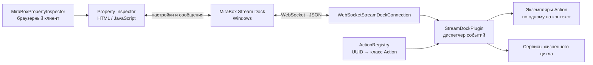

<div align="center">
  <p><a href="https://github.com/Nekit678/MiraboxStreamDockSDK/blob/main/README.md">English</a> · <strong>Русский</strong></p>
  
  <h1>MiraBox Stream Dock SDK</h1>
  <p><strong>Типизированный Python SDK для разработки плагинов MiraBox Stream Dock</strong></p>
  <p>
    <a href="https://pypi.org/project/mirabox-stream-dock-sdk/"></a>
    <a href="https://www.python.org/downloads/"></a>
    
    <a href="https://github.com/Nekit678/MiraboxStreamDockSDK/actions/workflows/ci.yml"></a>
    <a href="https://github.com/Nekit678/MiraboxStreamDockSDK/blob/main/LICENSE"></a>
  </p>
  <p>
    Создавайте переиспользуемые действия для клавиш, сенсорных панелей и энкодеров<br>
    без ручной реализации WebSocket-протокола Stream Dock.
  </p>
  <p>
    <a href="#быстрый-старт">Быстрый старт</a> ·
    <a href="https://pypi.org/project/mirabox-stream-dock-sdk/">PyPI</a> ·
    <a href="#пример-плагина-counter">Пример плагина</a> ·
    <a href="#основа-протокола">Протокол</a> ·
    <a href="#карта-api">API</a> ·
    <a href="#разработка">Разработка</a>
  </p>
</div>

---

## О проекте

`mirabox-stream-dock-sdk` предоставляет протокол, среду выполнения и браузерные
инструменты для создания Python-плагинов MiraBox Stream Dock. SDK проверяет
аргументы запуска и входящие сообщения, создаёт отдельный типизированный
экземпляр действия для каждого элемента управления, распределяет события
жизненного цикла и сериализует команды для приложения Stream Dock.

Изначально SDK разрабатывался в составе плагина для Stream Dock. Позже он был
вынесен в отдельный проект, чтобы использовать протокол и среду выполнения в
разных плагинах, независимо тестировать их и развивать как публичный пакет. SDK
будет и дальше дорабатываться по мере использования в реальных плагинах и
проверки новых особенностей Stream Dock.

> [!IMPORTANT]
> Сейчас проект находится в серии версий `0.x`. Он уже подходит для экспериментов
> и разработки реальных плагинов, но до выпуска `1.0` публичный API может меняться
> между минорными версиями.

> [!NOTE]
> Это неофициальный проект сообщества, не связанный с MiraBox, HotSpot или Elgato
> и не одобренный этими компаниями. Имя callback-функции
> `connectElgatoStreamDeckSocket` сохранено, потому что Stream Dock использует его
> для совместимости с Property Inspector.

## Содержание

- [Возможности](#возможности)
- [Как это работает](#как-это-работает)
- [Требования](#требования)
- [Установка](#установка)
- [Быстрый старт](#быстрый-старт)
- [Клиент Property Inspector](#клиент-property-inspector)
- [Пример плагина Counter](#пример-плагина-counter)
- [Основа протокола](#основа-протокола)
- [Карта API](#карта-api)
- [Ошибки и неизвестные события](#ошибки-и-неизвестные-события)
- [Логирование](#логирование)
- [Структура проекта](#структура-проекта)
- [Разработка](#разработка)
- [Выпуск релизов](#выпуск-релизов)

## Возможности

| | Возможность | Что даёт |
|:--:|---|---|
| 🧩 | Типизированный протокол | Dataclass-модели регистрации, команд и событий клавиш, сенсорной панели, энкодеров, устройств, приложений и настроек. |
| 🧭 | Точная валидация | Ошибка в payload содержит имя события и полный путь к некорректному полю JSON. |
| 🎛️ | Среда выполнения действий | Отдельный экземпляр действия для каждого контекста, декларативная регистрация UUID и автоматическая маршрутизация событий. |
| 🔌 | WebSocket-транспорт | Регистрация, разбор сообщений, сериализация команд, журналирование и корректное завершение работы. |
| 🗃️ | Типизированные настройки | Подключаемые кодеки для настроек действий, глобальных настроек и сообщений Property Inspector. |
| 🖥️ | Property Inspector | Версионируемый JavaScript-клиент без зависимостей: состояние соединения, события, настройки и очередь сообщений при запуске. |
| 🧰 | Сервисы плагина | Предсказуемый запуск и остановка фоновых сервисов, принадлежащих плагину. |
| 📦 | Инструменты дистрибуции | CLI для копирования ресурсов, пример PyInstaller, проверка пакета, CI и Trusted Publishing. |
| 🛡️ | Прямая совместимость | Неизвестные корректные события сохраняются как `UnknownStreamDockEvent`, не останавливая плагин. |

## Как это работает



Stream Dock запускает упакованный `.exe` плагина и передаёт WebSocket-порт, UUID
плагина, событие регистрации и метаданные приложения. `run_plugin_cli()`
разбирает эти аргументы, а `StreamDockPlugin` регистрирует плагин и направляет
входящие события нужному экземпляру действия.

## Требования

- Python `3.11+`;
- MiraBox Stream Dock `2.10.179.426` или новее (заявленный минимум);
- `websocket-client>=1.8,<2` (устанавливается автоматически);
- Windows для запуска Stream Dock и упаковки автономного плагина через PyInstaller.

Интеграция SDK со Stream Dock вручную проверена на версии Stream Dock
`3.10.203.0701`.

Разрабатывать сам SDK и запускать его тесты можно в Windows, Linux или WSL.
Финальный `.exe` необходимо собирать в Windows: PyInstaller не является
кросс-компилятором.

## Установка

Установите выпущенный пакет из PyPI:

```bash
python -m pip install mirabox-stream-dock-sdk
```

Для разработки SDK из исходников:

```bash
git clone https://github.com/Nekit678/MiraboxStreamDockSDK.git
cd MiraboxStreamDockSDK
python -m venv .venv
```

<details>
<summary><strong>Windows PowerShell</strong></summary>

```powershell
.venv\Scripts\Activate.ps1
python -m pip install --upgrade pip
python -m pip install -e ".[dev]"
```

</details>

<details>
<summary><strong>Linux / WSL</strong></summary>

```bash
source .venv/bin/activate
python -m pip install --upgrade pip
python -m pip install -e ".[dev]"
```

</details>

## Быстрый старт

Опишите зависимости, общие для экземпляров действий, зарегистрируйте каждый
UUID и верните настроенный `StreamDockPlugin` из фабрики приложения:

```python
from __future__ import annotations

from dataclasses import dataclass

from mirabox_sdk import (
    Action,
    ActionRegistry,
    JsonObject,
    KeyDownEvent,
    PluginLaunchArguments,
    StreamDockPlugin,
    StreamDockSender,
    WebSocketStreamDockConnection,
    WillAppearEvent,
    run_plugin_cli,
)

ACTION_UUID = "com.example.counter.increment"


@dataclass(frozen=True, slots=True)
class Dependencies:
    stream_dock: StreamDockSender


registry: ActionRegistry[Dependencies] = ActionRegistry()


@registry.register(ACTION_UUID)
class CounterAction(Action[JsonObject, Dependencies]):
    def _render(self) -> None:
        count = self.settings.get("count", 0)
        self.set_title(str(count if type(count) is int else 0))

    def on_will_appear(self, _event: WillAppearEvent) -> None:
        self._render()

    def on_key_down(self, _event: KeyDownEvent) -> None:
        count = self.settings.get("count", 0)
        self.set_settings({"count": (count if type(count) is int else 0) + 1})
        self._render()


def build_application(arguments: PluginLaunchArguments) -> StreamDockPlugin[Dependencies]:
    connection = WebSocketStreamDockConnection(arguments.port)
    return StreamDockPlugin(
        arguments,
        stream_dock=connection,
        action_registry=registry,
        action_dependencies=Dependencies(connection),
    )


if __name__ == "__main__":
    raise SystemExit(run_plugin_cli(build_application))
```

Точно такой же UUID действия должен быть объявлен в `manifest.json` плагина.
Stream Dock создаёт и удаляет контексты событиями `willAppear` и
`willDisappear`, а среда выполнения управляет соответствующими Python-объектами.

### Callback-методы действий

Переопределяйте только те методы, которые нужны конкретному действию:

| Входное событие или этап | Callback класса `Action` |
|---|---|
| Действие появилось или исчезло | `on_will_appear`, `on_will_disappear` |
| Нажатие или отпускание клавиши | `on_key_down`, `on_key_up` |
| Касание сенсорной панели | `on_touch_tap` |
| Нажатие, отпускание или поворот энкодера | `on_dial_down`, `on_dial_up`, `on_dial_rotate` |
| Изменение настроек или параметров заголовка | `on_did_receive_settings`, `on_title_parameters_did_change` |
| Property Inspector открыт, закрыт или отправил данные | `on_property_inspector_did_appear`, `on_property_inspector_did_disappear`, `on_send_to_plugin` |
| События устройств, приложений и пробуждения | `on_device_did_connect`, `on_device_did_disconnect`, `on_application_did_launch`, `on_application_did_terminate`, `on_system_did_wake_up` |

Вспомогательные методы `Action` покрывают основные исходящие команды:
`set_title()`, `set_image()`, `set_state()`, `set_settings()`, `get_settings()`,
`show_ok()`, `show_alert()`, `open_url()`, `log_message()` и
`send_to_property_inspector()`.

### Типизированные настройки

По умолчанию действия работают с JSON-объектами. Для собственного типа данных
задайте `JsonCodec` в классе действия:

```python
from dataclasses import dataclass

from mirabox_sdk import Action, FunctionalJsonCodec, JsonObject


@dataclass(frozen=True, slots=True)
class CounterSettings:
    count: int


def decode_settings(value: JsonObject) -> CounterSettings:
    count = value.get("count", 0)
    if type(count) is not int:
        raise ValueError("count must be an integer")
    return CounterSettings(count)


COUNTER_SETTINGS_CODEC = FunctionalJsonCodec(
    decoder=decode_settings,
    encoder=lambda value: {"count": value.count},
)


class CounterAction(Action[CounterSettings, Dependencies]):
    settings_codec = COUNTER_SETTINGS_CODEC
```

Граница кодека проверяет, что закодированные значения являются корректным JSON.
Ошибки декодирования дополняются именем события и путём к настройкам.

### Глобальные настройки

Используйте `update_global_settings()`, когда несколько изменений в памяти
образуют одну логическую операцию. Callback работает с изолированным черновиком;
исключение или некорректный итоговый JSON откатывает всё обновление:

```python
def append_items(settings: JsonObject) -> None:
    items = settings.get("items")
    if not isinstance(items, list):
        raise ValueError("items must be a list")
    items.extend(values)


runtime.update_global_settings(append_items)
```

После успешного callback транзакция валидирует весь черновик и сохраняет его
одной командой `setGlobalSettings`. Ошибка callback, валидации или отправки
оставляет прежнее локальное состояние без изменений. Прямые мутации
`runtime.global_settings` остаются совместимыми для локального replay-состояния,
но для группы связанных сохраняемых изменений предпочтителен транзакционный
метод.

## Клиент Property Inspector

Скопируйте JavaScript-клиент из установленного SDK в пакет плагина:

```bash
mirabox-sdk copy-property-inspector \
  com.example.counter.sdPlugin/property-inspector
```

По умолчанию команда не перезаписывает отличающийся файл. При намеренном
обновлении встроенного клиента передайте `--force`.

Подключите клиент до скрипта конкретного действия:

```html
<script src="mirabox-sdk.js"></script>
<script src="counter.js"></script>
```

Stream Dock автоматически вызывает callback-функцию совместимости. Скрипт
действия использует общий клиент через `window.MiraBoxPropertyInspector`:

```javascript
const client = window.MiraBoxPropertyInspector;

client.on("connected", ({ settings }) => {
  console.log("Current settings", settings);
});

client.on("didReceiveSettings", ({ payload }) => {
  console.log("Updated settings", payload.settings);
});

client.sendToPlugin({ event: "refresh" });
client.updateSettings({ mode: "toggle" });
```

Клиент предоставляет `on()`, `off()`, `send()`, `sendToPlugin()`,
`setSettings()`, `updateSettings()` и `getSettings()`, а также состояние
соединения и регистрации. Сообщения, отправленные во время подключения
WebSocket, помещаются в очередь до открытия соединения.

## Пример плагина Counter

[`examples/counter_plugin`](https://github.com/Nekit678/MiraboxStreamDockSDK/tree/main/examples/counter_plugin)
— это полноценный плагин,
а не отдельный фрагмент кода. В нём есть:

- пакет с зарегистрированным действием-счётчиком;
- Property Inspector с кнопкой сброса счётчика;
- корректный `.sdPlugin`-пакет и манифест;
- SVG-ресурсы и спецификация PyInstaller;
- тесты поведения плагина.

Сборка исполняемого файла в Windows:

```powershell
python -m pip install pyinstaller
python -m PyInstaller --clean --noconfirm examples/counter_plugin/build.spec
Copy-Item dist\CounterPlugin.exe `
  examples\counter_plugin\com.example.counter.sdPlugin\
```

Скопируйте каталог `com.example.counter.sdPlugin` в
`%APPDATA%\HotSpot\StreamDock\plugins\` и перезапустите Stream Dock. Команда
запуска из исходников и полный процесс упаковки описаны в
[руководстве примера](https://github.com/Nekit678/MiraboxStreamDockSDK/blob/main/examples/counter_plugin/README.md).

## Основа протокола

Этот пакет — независимая типизированная Python-реализация WebSocket / JSON API
плагинов, опубликованного MiraBox. Основные первичные источники:

- [официальный репозиторий StreamDock Plugin SDK](https://github.com/MiraboxSpace/StreamDock-Plugin-SDK),
  включая [шаблон для Python](https://github.com/MiraboxSpace/StreamDock-Plugin-SDK/tree/main/SDPythonSDK);
- официальные описания [регистрации](https://sdk.key123.vip/en/guide/registration.html),
  [входящих событий](https://sdk.key123.vip/en/guide/events-received.html) и
  [исходящих событий](https://sdk.key123.vip/en/guide/events-sent.html);
- официальные справочники по [`manifest.json`](https://sdk.key123.vip/en/guide/manifest.html)
  и [Property Inspector](https://sdk.key123.vip/en/guide/property-inspector.html);
- [обзор upstream-шаблонов на DeepWiki](https://deepwiki.com/MiraboxSpace/StreamDock-Plugin-SDK)
  как дополнительный автоматически сформированный источник;
- [Space Platform](https://space.key123.vip/) для публикации готовых плагинов
  Stream Dock.

Локальная
[карта протокола](https://github.com/Nekit678/MiraboxStreamDockSDK/blob/main/docs/PROTOCOL.md)
связывает каждое поддерживаемое
wire-событие и команду с Python-моделью или вспомогательным методом и отдельно
отмечает поведение, проверенное в Stream Dock, но пока отсутствующее в
опубликованном списке событий. Если документация и наблюдаемое поведение
расходятся, реализованное SDK поведение фиксируется тестами.

## Карта API

| Область | Публичный API |
|---|---|
| Среда выполнения | `Action`, `ActionRegistry`, `StreamDockPlugin`, `LifecycleService` |
| Соединение | `WebSocketStreamDockConnection`, `StreamDockConnection`, `StreamDockSender`, `StreamDockListener` |
| Запуск и регистрация | `PluginLaunchArguments`, модели регистрации, `parse_plugin_cli_arguments`, `run_plugin_cli` |
| Входящие события | Типизированные модели клавиш, касаний, энкодеров, настроек, Property Inspector, устройств, приложений и системы |
| Исходящие команды | Модели регистрации, настроек, заголовка, изображения, состояния, обратной связи, URL, логов и Property Inspector |
| Данные приложения | `JsonCodec`, `FunctionalJsonCodec`, `JsonObjectCodec`, типизированные функции кодирования и декодирования |
| Ресурсы | `copy_property_inspector_client`, `property_inspector_client_bytes`, CLI `mirabox-sdk` |
| Разбор протокола | `parse_stream_dock_event`, `parse_registration_info`, типизированные ошибки протокола |
| Логирование | `configure_logging` с управлением консолью, файлом и отключением |

Поддерживаемый публичный интерфейс экспортируется из `mirabox_sdk`. Объекты из
отдельных модулей считаются деталями реализации, если они дополнительно не
экспортированы на верхнем уровне.

## Ошибки и неизвестные события

| Исключение | Значение |
|---|---|
| `InvalidPluginLaunchArgumentsError` | Stream Dock передал некорректные аргументы исполняемого файла. |
| `InvalidRegistrationInfoError` | JSON с метаданными регистрации содержит неверное поле. |
| `MalformedEventError` / `InvalidFieldError` | Известное событие повреждено; ошибка содержит путь к полю JSON. |
| `UnsupportedEventError` | Неизвестное событие разобрано с `allow_unknown=False`. |
| `JsonCodecDecodeError` | Настройки или сообщения плагина не удалось декодировать. |
| `JsonCodecEncodeError` | Кодек создал значение, которое нельзя отправить как JSON. |

По умолчанию `parse_stream_dock_event()` сохраняет неизвестный, но структурно
корректный конверт как `UnknownStreamDockEvent`. Это позволяет SDK переживать
расширения протокола, сохраняя строгую проверку известных событий.

## Логирование

По умолчанию логирование SDK отключено: сообщения не передаются корневому logger
приложения и файл лога не создаётся. Включите диагностику явно перед вызовом
`run_plugin_cli()`:

```python
from mirabox_sdk import configure_logging

configure_logging(level="INFO")
```

Если файл не указан, включённые логи выводятся в stderr. Для записи UTF-8-лога в
файл передайте путь; отсутствующие родительские каталоги будут созданы
автоматически. По умолчанию файл ротируется при размере 5 MiB и хранит три
резервные копии:

```python
from pathlib import Path

from mirabox_sdk import configure_logging

configure_logging(
    level="DEBUG",
    log_file=Path.home() / ".mirabox-counter" / "plugin.log",
    max_bytes=5 * 1024 * 1024,
    backup_count=3,
)
```

Значения `max_bytes` и `backup_count` можно подобрать под плагин. Используйте
`max_bytes=0` только когда неограниченный размер файла выбран намеренно.

`include_payload=True` добавляет полное входящее и исходящее сообщение протокола
в записи уровня `DEBUG`. Payload может содержать токены, настройки и другие
секреты, поэтому включайте эту опцию только временно в доверенной среде
разработки. Уберите опцию (по умолчанию она равна `False`), чтобы снова скрывать
payload, не отключая остальные диагностические сообщения.

```python
configure_logging(
    level="DEBUG",
    log_file=Path.home() / ".mirabox-counter" / "plugin.log",
    include_payload=True,
)
```

Повторный вызов заменяет handler, ранее созданный `configure_logging()`, поэтому
уровень и назначение можно менять без дублирования сообщений. Для возврата в
исходный бесшумный режим:

```python
configure_logging(enabled=False)
```

На уровне `INFO` записываются состояние соединения и другие операционные
события. Направление, событие и контекст каждого сообщения протокола выводятся
только на уровне `DEBUG`. Payload остаётся скрытым, если только явно не настроено
`include_payload=True`. Handlers, установленные приложением вручную, остаются
его ответственностью.

## Структура проекта

```text
MiraboxStreamDockSDK/
├── pyproject.toml                     # Метаданные пакета и настройки инструментов
├── src/mirabox_sdk/
│   ├── action.py                      # Базовый класс действия
│   ├── action_registry.py             # Реестр UUID действий
│   ├── commands.py                    # Типизированные исходящие команды
│   ├── events.py                      # Модели входящих событий
│   ├── parser.py                      # Строгий разбор сообщений
│   ├── plugin.py                      # Среда выполнения и диспетчер жизненного цикла
│   ├── connection.py                  # WebSocket-транспорт
│   ├── logging_config.py              # Изолированная настройка логирования SDK
│   └── property_inspector/            # Ресурс браузерного SDK
├── examples/counter_plugin/           # Полный собираемый плагин
├── tests/                             # Тесты SDK и release-инструментов
├── scripts/                           # Проверка версий и дистрибутивов
└── .github/workflows/                 # CI и релизы через Trusted Publishing
```

## Разработка

Установите зависимости для разработки и запустите те же проверки, что и CI:

```bash
python -m unittest discover -s tests -v
PYTHONPATH=examples/counter_plugin/src \
  python -m unittest discover -s examples/counter_plugin/tests -v
python -m compileall -q src tests scripts examples
ruff check src tests scripts examples
ruff format --check src tests scripts examples
python -m build
python scripts/verify_distribution.py dist
python -m twine check dist/*
```

Тесты используют имитации соединения и сообщений протокола — запущенный Stream
Dock не требуется. CI проверяет SDK в Linux и Windows на всех поддерживаемых
версиях Python.

Улучшения приветствуются. Перед отправкой изменений прочитайте
[CONTRIBUTING.md](https://github.com/Nekit678/MiraboxStreamDockSDK/blob/main/CONTRIBUTING.md),
а при изменении наблюдаемого поведения
протокола укажите версию Stream Dock и добавьте регрессионный тест.

## Выпуск релизов

Релизы собираются по тегам версий, публикуются на PyPI через Trusted Publishing
и прикрепляются к автоматически созданному GitHub Release. Одноразовая настройка
и полный release-чеклист находятся в
[RELEASING.md](https://github.com/Nekit678/MiraboxStreamDockSDK/blob/main/RELEASING.md).

## Лицензия

Проект распространяется по
[лицензии MIT](https://github.com/Nekit678/MiraboxStreamDockSDK/blob/main/LICENSE).

---

<div align="center">
  Для переиспользуемых Python-плагинов MiraBox Stream Dock.
</div>
